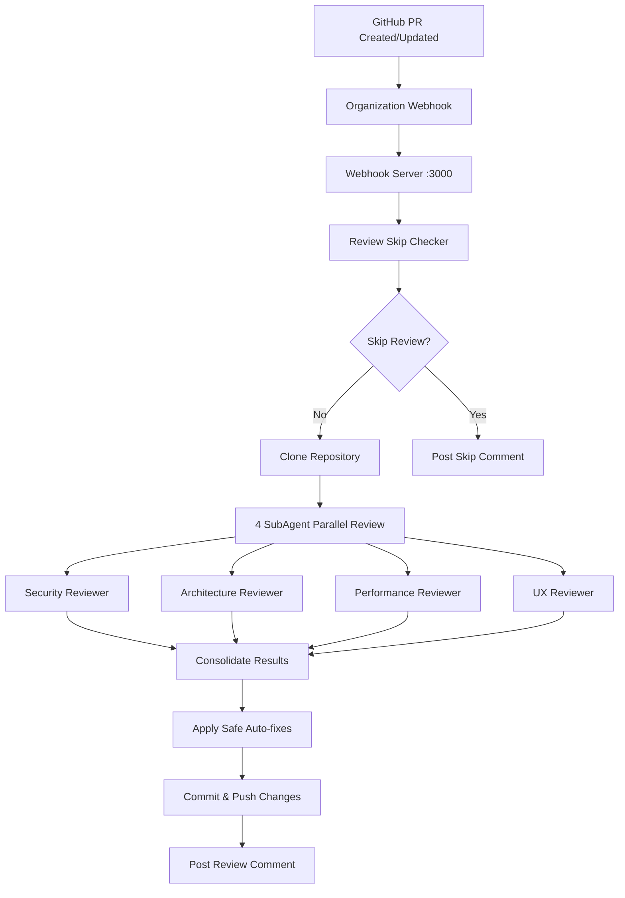

# 🤖 GitHub Organization AI Review System

Claude Code SubAgent를 활용한 GitHub Organization 레벨 PR 자동 리뷰 시스템

[](https://opensource.org/licenses/MIT)
[](https://nodejs.org/)
[](https://docs.anthropic.com/en/docs/claude-code)

## ✨ 주요 기능

- **🏢 Organization 레벨 웹훅**: 조직 내 모든 저장소의 PR을 자동 감지
- **🤖 4개 전문 SubAgent 병렬 리뷰**: 
  - 🛡️ **Security Reviewer** - 보안 취약점, 인증 메커니즘, 데이터 보호
  - 🏗️ **Architecture Reviewer** - 시스템 설계 패턴, 코드 구조, 확장성
  - ⚡ **Performance Reviewer** - 성능 최적화, 리소스 사용량, 알고리즘 효율성
  - 🎨 **UX Reviewer** - 사용자 경험, 접근성, UI 일관성
- **🧠 스마트 리뷰 스킵**: 문서 전용, 설정 파일 등 간단한 변경사항 자동 스킵
- **🔧 안전한 자동 수정**: AI가 제안한 안전한 수정사항 자동 적용
- **💬 수동 트리거**: `@claude-bot review` 댓글로 강제 리뷰 실행
- **📊 실시간 진행 상황**: 리뷰 시작/완료 댓글로 진행 상황 알림

## 🚀 빠른 시작

### 1. 프로젝트 클론

```bash
git clone https://github.com/team-off-the-record/github-ai-review-system.git
cd github-ai-review-system
```

### 2. 의존성 설치

```bash
npm install
```

### 3. 환경변수 설정

```bash
# ~/.bashrc에 다음 3줄 추가
export GITHUB_WEBHOOK_TOKEN="your_github_token"
export GITHUB_WEBHOOK_SECRET="your_webhook_secret"  
export ORGANIZATION_NAME="your_organization_name"

source ~/.bashrc
```

### 4. 시스템 테스트

```bash
./scripts/test-system.sh
```

### 5. 서버 시작

```bash
./scripts/start-webhook-server.sh
```

## 📁 프로젝트 구조

```
github-ai-review-system/
├── README.md                   # 이 파일
├── package.json               # Node.js 의존성
├── scripts/                   # 실행 스크립트들
│   ├── setup-env-simple.sh    # 환경변수 설정 가이드
│   ├── setup-org-webhook.sh   # Organization 웹훅 설정
│   ├── check-org-webhook.sh   # 웹훅 상태 확인
│   ├── test-system.sh         # 전체 시스템 테스트
│   ├── start-webhook-server.sh # 서버 시작
│   └── org-review-stats.sh    # 통계 및 모니터링
├── src/                       # 소스 코드
│   ├── webhook-server.js      # 메인 웹훅 서버 (@ 멘션 방식)
│   └── review-skip-checker.js # 스마트 리뷰 스킵 로직
└── logs/                      # 로그 파일들
    └── webhook-server.log     # 서버 로그
```

## 🔧 설정

### GitHub Token 권한

다음 권한이 필요합니다:
- `admin:org` - Organization 웹훅 설정
- `repo` - 저장소 접근 및 PR 댓글
- `write:discussion` - 토론 작성 (선택사항)

### 웹훅 설정

```bash
# Organization 웹훅 설정
./scripts/setup-org-webhook.sh YOUR_ORG_NAME YOUR_WEBHOOK_SECRET

# 웹훅 상태 확인
./scripts/check-org-webhook.sh YOUR_ORG_NAME
```

## 🎯 사용법

### 자동 리뷰
PR을 생성하거나 업데이트하면 자동으로 AI 리뷰가 시작됩니다:

1. **시작 댓글** - 리뷰가 시작되면 즉시 댓글 게시
2. **4개 SubAgent** - 병렬로 전문 리뷰 수행 (3-5분)
3. **완료 댓글** - 리뷰 결과 및 자동 수정사항 게시

### 수동 트리거
PR 댓글에 `@claude-bot review` 입력하여 강제 리뷰 실행

### 모니터링

```bash
# 실시간 로그
tail -f logs/webhook-server.log

# 서버 상태
curl http://localhost:3000/health
curl http://localhost:3000/status

# AI 리뷰 통계
./scripts/org-review-stats.sh $ORGANIZATION_NAME 7
```

## 🧪 테스트

### 자동 테스트 PR 생성

```bash
cd /tmp
gh repo clone your_org/your_repo
cd your_repo
git checkout -b test-ai-review-$(date +%s)
echo "# AI Review Test" > test-file.md
git add test-file.md
git commit -m "test: AI review system"
git push origin HEAD
gh pr create --title "[TEST] AI Review System" --body "Testing AI review"
```

## 📊 리뷰 결과 예시

AI 리뷰 완료 시 다음과 같은 댓글이 자동으로 추가됩니다:

```markdown
## 🤖 AI Code Review Summary

**Overall Score:** 85/100

### 📊 Review Statistics
- **Agents Completed:** 4/4
- **Issues Found:** 12 total
  - 🔴 High: 2
  - 🟡 Medium: 5  
  - 🟢 Low: 5
- **Auto Fixes Applied:** 8

### 🔍 Key Issues Found
1. 🔴 **Security** in `auth.js:45`
   SQL injection vulnerability detected
   💡 *Suggestion: Use parameterized queries*

2. 🟡 **Performance** in `api.js:123`
   Inefficient database query in loop
   💡 *Suggestion: Use batch queries*

### 💡 Recommendations
1. Implement input validation for all user inputs
2. Add error handling for async operations
3. Consider implementing caching for frequently accessed data
```

## 🔍 문제해결

| 문제 | 해결방법 |
|------|----------|
| 웹훅 오류 | `./scripts/check-org-webhook.sh $ORGANIZATION_NAME` |
| SubAgent 오류 | Claude Code가 설치되어 있는지 확인 |
| GitHub 권한 오류 | `gh auth login` |
| 환경변수 미설정 | `./scripts/setup-env-simple.sh` |

## 🤝 기여하기

1. Fork the repository
2. Create your feature branch (`git checkout -b feature/amazing-feature`)
3. Commit your changes (`git commit -m 'Add some amazing feature'`)
4. Push to the branch (`git push origin feature/amazing-feature`)
5. Open a Pull Request

## 📝 주요 명령어

| 명령어 | 설명 |
|--------|------|
| `./scripts/setup-env-simple.sh` | 환경변수 설정 가이드 |
| `./scripts/test-system.sh` | 전체 시스템 테스트 |
| `./scripts/start-webhook-server.sh` | 웹훅 서버 시작 |
| `./scripts/setup-org-webhook.sh ORG SECRET` | 웹훅 설정 |
| `./scripts/check-org-webhook.sh ORG` | 웹훅 상태 확인 |
| `./scripts/org-review-stats.sh ORG [DAYS]` | 통계 확인 |

## ⚡ 요구사항

- **Node.js** 18.x 이상
- **Claude Code** 설치 및 인증 완료
- **GitHub CLI** (`gh`) 설치 및 인증 완료
- **Git** 2.x 이상
- **조직 관리자 권한** (웹훅 설정용)

## 🏗️ 아키텍처



## 🔒 보안

- 모든 민감한 정보는 환경변수로 관리
- GitHub 웹훅 시그니처 검증
- Claude API 키 불필요 (Claude Code 사용)
- 안전한 자동 수정만 적용

## 📄 라이선스

이 프로젝트는 MIT 라이선스 하에 배포됩니다. 자세한 내용은 [LICENSE](LICENSE) 파일을 참조하세요.

## 🙏 감사의 말

- [Anthropic Claude](https://www.anthropic.com/) - AI 파워
- [Claude Code](https://docs.anthropic.com/en/docs/claude-code) - 개발 도구
- [GitHub API](https://docs.github.com/en/rest) - 웹훅 및 PR 관리

---

**프로젝트 위치**: `~/github-ai-review-system/`  
**시작 명령어**: `./scripts/start-webhook-server.sh`  
**리포지토리**: https://github.com/team-off-the-record/github-ai-review-system

Made with ❤️ by Claude AI Review System
